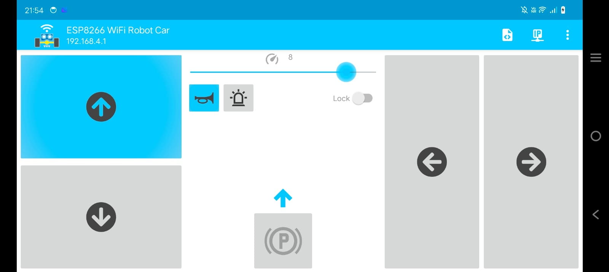

# ESP8266 Mobile Controlled RC Car

A WiFi-controlled RC car built with ESP8266 NodeMCU, controllable via smartphone through a web interface.

## 📋 Table of Contents
- [Overview](#overview)
- [Features](#features)
- [Hardware Requirements](#hardware-requirements)
- [Software Requirements](#software-requirements)
- [Installation](#installation)
- [Usage](#usage)
- [Project Structure](#project-structure)
- [How It Works](#how-it-works)
- [Troubleshooting](#troubleshooting)
- [Contact](#contact)

## 🔍 Overview

This project demonstrates a WiFi-controlled RC car using the ESP8266 microcontroller. The car can be controlled wirelessly from any device with a web browser (smartphone, tablet, or computer) connected to the same WiFi network. The ESP8266 creates a web server that provides an intuitive control interface for movement in all directions.

## ✨ Features

- **Wireless Control**: Control via WiFi using any web browser
- **Intuitive Interface**: Simple web-based control panel
- **Multi-directional Movement**: Forward, backward, left, right, and stop
- **Real-time Response**: Instant command execution
- **Low Latency**: Quick response time for smooth control
- **Standalone Operation**: No internet required, works on local network
- **Mobile Friendly**: Responsive web interface optimized for smartphones

## 🔧 Hardware Requirements

### Components List

| Component | Quantity | Specifications |
|-----------|----------|----------------|
| ESP8266 NodeMCU | 1 | WiFi-enabled microcontroller |
| Motor Driver (L298N ) | 2 | Dual H-bridge motor driver |
| DC Motors | 4 | 3-6V DC geared motors |
| Chassis | 1 | 2WD or 4WD RC car chassis |
| Battery | 4 | 3.7(each)V Li-ion |
| Wheels | 4 | Compatible with motors |
| Jumper Wires | As needed | Male-to-male and male-to-female |
| Breadboard (Optional) | 1 | For prototyping |

### Tools Required
- Soldering iron and solder
- Wire strippers
- Screwdriver
- L-Clamps(to hold motors in place)


### Pin Connections

#### ESP8266 to Motor Driver
```
ESP8266 NodeMCU  →  L298N Motor Driver
─────────────────────────────────────
D1 (GPIO5)       →  IN1 (Motor A)
D2 (GPIO4)       →  IN2 (Motor A)
D5 (GPIO0)       →  IN3 (Motor B)
D6 (GPIO2)       →  IN4 (Motor B)
GND              →  GND
```

#### Motor Driver to Motors
```
Motor A (Left)   →  OUT1, OUT2 (Motor Driver 1)
Motor B (Right)  →  OUT1, OUT2 (Motor Driver 2)

```

#### Power Supply
```
Battery (+)      →  12V on L298N
Battery (-)      →  GND on L298N
5V from L298N    →  VIN on ESP8266 ```

**Note**: Make sure all grounds are connected together (common ground).

## 💻 Software Requirements

### Arduino IDE Setup
1. **Arduino IDE**: Version 1.8.13 or later
2. **ESP8266 Board Package**: Install via Board Manager
   - File → Preferences → Additional Board Manager URLs
   - Add: `http://arduino.esp8266.com/stable/package_esp8266com_index.json`
   - Tools → Board → Board Manager → Search "ESP8266" → Install

### Required Libraries
- ESP8266WiFi (included with ESP8266 board package)
- ESP8266WebServer (included with ESP8266 board package)

No additional library installation needed!

## 📥 Installation

### Step 1: Clone the Repository
```bash
git clone https://github.com/yourusername/esp8266-rc-car.git
cd esp8266-rc-car
```

### Step 2: Hardware Assembly
1. Mount the ESP8266 and motor driver on the chassis
2. Connect motors to the motor driver outputs
3. Wire the ESP8266 to the motor driver according to the pin connections
4. Connect the battery to the motor driver
5. Ensure all connections are secure and insulated

### Step 3: Configure WiFi Credentials
1. Open `esp8266_rc_car.ino` in Arduino IDE
2. Locate the WiFi configuration section:
```cpp
const char* ssid = "YourWiFiName";      // Replace with your WiFi SSID
const char* password = "YourPassword";   // Replace with your WiFi password
```
3. Update with your WiFi network credentials

### Step 4: Upload Code
1. Connect ESP8266 to your computer via USB
2. Select the correct board: Tools → Board → ESP8266 Boards → NodeMCU 1.0
3. Select the correct port: Tools → Port → (your COM port)
4. Click Upload button
5. Wait for "Done uploading" message

### Step 5: Get IP Address
1. Open Serial Monitor (Tools → Serial Monitor)
2. Set baud rate to 115200
3. Press Reset button on ESP8266
4. Note the IP address displayed (e.g., 192.168.1.100)

## 🚀 Usage

### Connecting to the Car
1. Ensure your smartphone/device is connected to the same WiFi network
2. Open a web browser or esp8266-wifi-rc-car app on your device
3. Enter the IP address shown in Serial Monitor (e.g., `http://192.168.1.100`)/(if using app, it will automatically connect)
4. The control interface will load

### Controlling the Car
The web interface provides five control buttons:
- **Forward (↑)**: Move car forward
- **Backward (↓)**: Move car backward
- **Left (←)**: Turn left
- **Right (→)**: Turn right
- **Stop (■)**: Stop all motors

### Demo

*The RC car being controlled via smartphone*


*Mobile control interface*

## 📁 Project Structure

```
esp8266-rc-car/
│
├── README.md                    # Project documentation
│
├── pictures/                      # Images 
│   ├── rc_car.jpg
│   ├── rc_car_chasis.jpg
│   ├── rc_car_wiring.jpg
│   └── web_interface.jpg
│
├── video/                      # Demo videos
│   └── rc_car_demo.mp4
│
└── code/                       # Main Arduino sketch
    ├── rc_car.ino      ```

## ⚙️ How It Works

### Architecture Overview
1. **ESP8266 as Access Point/Client**: 
   - The ESP8266 connects to your WiFi network
   - Creates a web server on port 80
   
2. **Web Server**:
   - Serves an HTML control interface
   - Handles HTTP GET requests for commands
   
3. **Command Processing**:
   - Browser sends commands (e.g., `/forward`, `/left`)
   - ESP8266 receives and processes the command
   - GPIO pins are set HIGH/LOW to control motor driver
   
4. **Motor Control**:
   - Motor driver receives signals from ESP8266
   - Drives motors in the appropriate direction
   - Speed can be controlled via PWM (if implemented)

### Command Flow
```
User Press Button → HTTP Request → ESP8266 Web Server → 
→ GPIO Control → Motor Driver → Motors → Car Movement
```

## 🔧 Troubleshooting

### Car doesn't connect to WiFi
- Verify WiFi credentials are correct
- Check if WiFi network is 2.4GHz (ESP8266 doesn't support 5GHz)
- Ensure ESP8266 is within WiFi range
- Check Serial Monitor for error messages

### Car doesn't move
- Verify all connections are secure
- Check battery voltage (should be adequate)
- Test motors directly with battery
- Ensure motor driver is receiving power
- Check if LED on ESP8266 is blinking during commands

### Web interface not loading
- Confirm you're using the correct IP address
- Ensure device and ESP8266 are on same network
- Try refreshing the browser
- Check Serial Monitor to verify server is running

### Motors running in wrong direction
- Swap the motor wires on the motor driver outputs
- Or modify the code to reverse the GPIO logic

### Intermittent connection
- Improve WiFi signal strength
- Use a better power supply
- Add capacitors across motor terminals to reduce noise

## 📧 Contact

**Your Name**
- GitHub: [@codeubermensch](https://github.com/codeubermensch)
- Email:maithreshgokulkumar@gmail.com
- LinkedIn: [Maithresh Gokul Kumar](https://www.linkedin.com/in/maithresh-gokul-kumar-996122326/)


